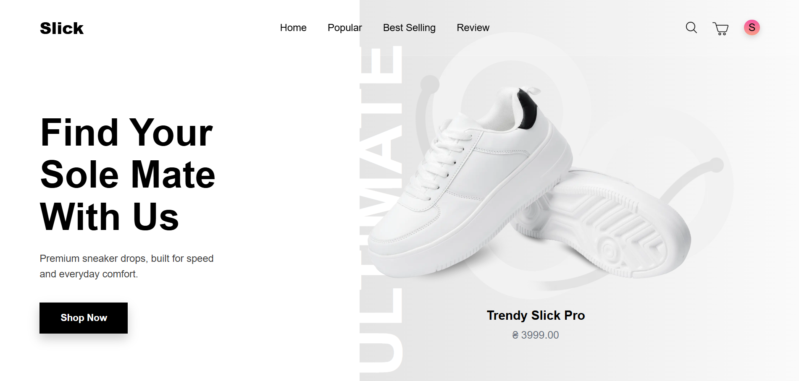

# 👟 Shoes Store - Modern E-commerce Platform

A modern, fully-featured e-commerce platform for shoes built with Next.js, featuring real-time animations, user authentication, shopping cart management, and an admin dashboard.


<div align="center">

[](https://nextjs.org)
[](https://react.dev)
[](https://www.typescriptlang.org)
[](https://tailwindcss.com)

</div>

## ✨ Features

- 🎨 **Smooth Animations** - Powered by Framer Motion for engaging UI transitions
- 🛍️ **Product Catalog** - Dynamic product listing with filtering and sorting
- 🛒 **Shopping Cart** - State management with Zustand and Context API
- 👤 **User Authentication** - Sign up, login, and profile management
- 💳 **Checkout System** - Secure payment processing integration
- ⭐ **Product Reviews** - Customer feedback and rating system
- 👨‍💼 **Admin Dashboard** - Manage products, orders, users, and payments
- 📱 **Responsive Design** - Mobile-first approach with TailwindCSS
- 🔐 **Protected Routes** - Admin guard and authentication checks
- 💬 **Real-time Chat** - Socket.io integration for support

## 🚀 Technology Stack

### Frontend
- **Framework**: [Next.js 16](https://nextjs.org) - React framework with App Router
- **Language**: [TypeScript](https://www.typescriptlang.org) - Type-safe development
- **Styling**: [Tailwind CSS 4](https://tailwindcss.com) - Utility-first CSS
- **Animations**: [Framer Motion](https://www.framer.com/motion) - Production-ready motion library
- **Icons**: [Lucide React](https://lucide.dev) - Beautiful SVG icon library
- **State Management**: [Zustand](https://github.com/pmndrs/zustand) - Lightweight state container
- **UI Alerts**: [SweetAlert2](https://sweetalert2.github.io) - Beautiful popup modals

### Backend Integration
- **API Server**: Express.js backend (Render.com deployment)
- **Real-time**: [Socket.io](https://socket.io) - WebSocket communication
- **Data Format**: RESTful JSON API

### Development Tools
- **Linting**: ESLint 9
- **Package Manager**: npm
- **Environment**: Node.js with dotenv


## 🛠️ Getting Started

### Prerequisites
- Node.js 18+ and npm installed
- Backend server running at `https://shoesstore-server.onrender.com`

### Installation

1. **Clone the repository**
   ```bash
   git clone <repository-url>
   cd ShoesStore
   ```

2. **Install dependencies**
   ```bash
   npm install
   ```

3. **Set up environment variables**
   ```bash
   cp .env.example .env.local
   ```
   Configure your environment variables (backend URL, API keys, etc.)

4. **Run the development server**
   ```bash
   npm run dev
   ```
   Open [http://localhost:3000](http://localhost:3000) in your browser

### Available Scripts

```bash
# Development
npm run dev          # Start dev server with hot reload

# Production
npm run build        # Build for production
npm start            # Start production server

# Code Quality
npm run lint         # Run ESLint
```

## 📁 Project Structure

```
ShoesStore/
├── app/                           # Next.js App Router
│   ├── (shop)/                   # Shop layout group
│   │   ├── product/[id]/         # Dynamic product pages
│   │   ├── checkout/             # Checkout flow
│   │   ├── login/ & register/    # Authentication
│   │   └── profile/              # User profile
│   ├── admin/                    # Admin dashboard (protected)
│   ├── success/ & cancel/        # Payment callbacks
│   └── layout.tsx                # Root layout
├── components/                    # React components
│   ├── adminComponents/          # Admin-specific UI
│   ├── profileComponents/        # Profile-related UI
│   ├── Popup/                    # Modal components
│   ├── ScrollAnimated/           # Animation effects
│   └── context/                  # React Context providers
├── store/                        # Zustand store (cart state)
├── utils/                        # Utility functions
│   └── backendData/              # API service calls
├── types/                        # TypeScript type definitions
├── public/                       # Static assets
└── next.config.ts               # Next.js configuration
```

## 🎯 Key Features Explained

### State Management
- **Cart State**: Dual system using both Zustand (`useCartStore`) and Context API for flexibility
- **Auth State**: localStorage-based authentication via `AuthContext`
- **Data Fetching**: Direct API calls to backend from utils/backendData

### Animation System
- **Framer Motion**: Used for smooth page transitions and component reveals
- **Scroll-triggered Animations**: `ScrollAnimated/Reveal.tsx` for on-scroll effects
- **SVG Icons**: Lucide React for consistent, scalable icons

### Admin Features
- **Dashboard**: Centralized admin panel for managing the store
- **Order Management**: Track and manage customer orders
- **Product Management**: Add, edit, and remove products
- **User Management**: View and manage customer accounts
- **Payment Tracking**: Monitor all transactions

## 🔌 Backend Integration

The frontend communicates with a backend API:
- **Base URL**: `https://shoesstore-server.onrender.com/api`
- **Endpoints**: 
  - `/goods` - Product catalog
  - `/orders` - Order management
  - `/payments` - Payment processing
  - `/users` - User management
  - `/feedbacks` - Customer reviews

## 🔐 Authentication & Authorization

- User login/register with email verification
- JWT token-based authentication
- Admin routes protected with `AdminGuard.tsx`
- Session persistence via localStorage

## 📖 Learn More

- [Next.js Documentation](https://nextjs.org/docs) - Next.js features and API
- [Framer Motion Docs](https://www.framer.com/motion) - Animation library
- [Tailwind CSS](https://tailwindcss.com/docs) - Styling framework
- [Zustand](https://github.com/pmndrs/zustand) - State management

## 🚀 Deployment

Deploy to Vercel (recommended for Next.js apps):

```bash
npm install -g vercel
vercel
```

Or use other platforms:
- Netlify
- AWS Amplify
- Railway
- Render

## 📝 Environment Variables

Required environment variables in `.env.local`:

```env
NEXT_PUBLIC_API_URL=https://shoesstore-server.onrender.com
NEXT_PUBLIC_SOCKET_URL=https://shoesstore-server.onrender.com
```

## 🤝 Contributing

Contributions are welcome! Please feel free to submit a Pull Request.

## 📄 License

This project is open source and available under the MIT License.

---

<div align="center">

**Built with ❤️ using Next.js, React & TailwindCSS**

⭐ If you like this project, please star it!

</div>
